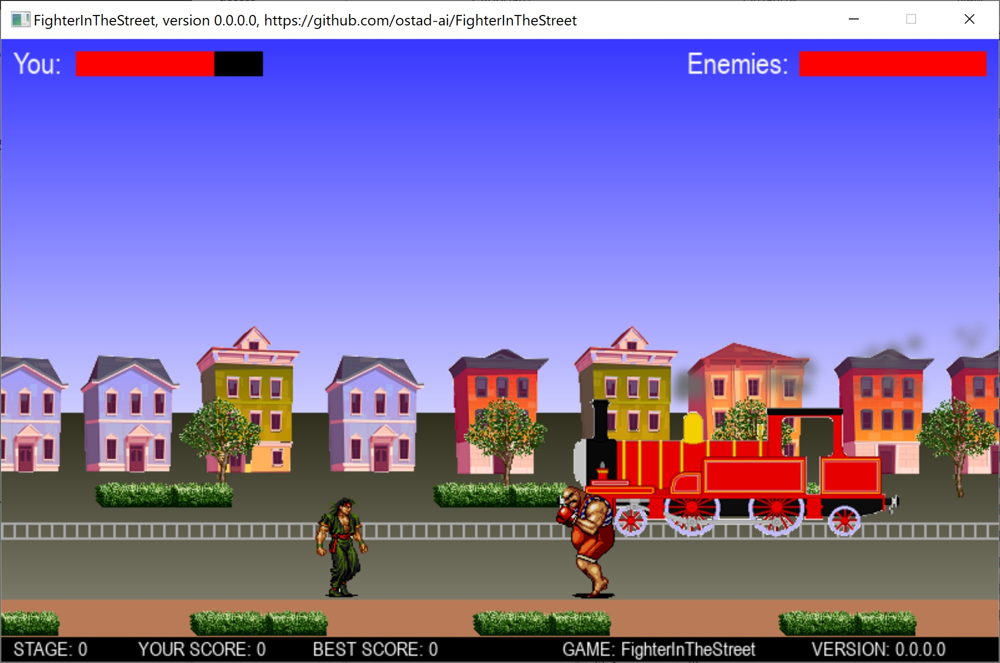
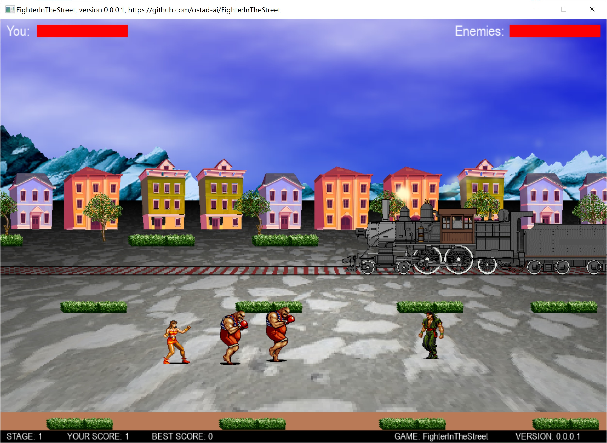

# FighterInTheStreet
### Newest: version 0.0.0.1
1. Now, you can also move back and forth by UP and DOWN arrow keys. 
2. Cloud, mountain, and terrain generators have been added to make the scene more realistic.
3. A new animated train has also been added.
4. The resolution of the game has been increased.
## This archive includes the executable program, fighterinthestreet.exe, which you should click on to run.
[Download the archive for win64](https://drive.google.com/file/d/1uD4fx8iEjwHmM7RN1MCYVdrqwhHs4C2U/view?usp=sharing)
### version 0.0.0.0
1. A 2D Fighting game.
2. you can punch and kick using keys A, S, D, and W.
3. You can jump by Space key.
---
 *Figure 1: A snapshot of Fighter-In-The-Street while playing the game.*
--- 
 *Figure 2: A snapshot of Fighter-In-The-Street while playing the game.*
---